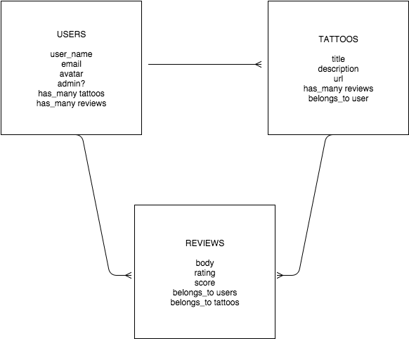

# Introduction

CodersInk is a review website hosted at https://codersink.herokuapp.com/tattoos.  The application was designed and built by the tics project team during the Fall 2015 cohort at Launch Academy (http://www.launchacademy.com/).

 

# Topics

- [Features](#features)
- [Development](#development)
    - [Testing](#testing)
    - [Test Development](#test-development)
- [ER Diagram](#er-diagram)
- [License](#license)

# Features

- The ability to add an item to be reviewed.
- The ability to rate the item and to optionally comment on it (i.e. write a review).
- The ability to upvote or downvote a review. A user can only upvote or downvote once and can change their vote from up to down. This feature utilizes AJAX so that a complete page reload isn't necessary.
- A sign up and authentication system for your users (developed with Devise).
- An ability to upload a profile photo (developed with Carrierwave).
- The ability to search for items.
- An admin role. Admins are able to delete comments or items if they are deemed to be inappropriate.
- An email is sent to the owner of an item when a new review is posted about it.
- Pagination (developed with Kaminari).
- Infinite scroll for the index page (developed with Javascript)

# Development

CodersInk was developed in Ruby on Rails.  Initial setup was done using the make_it_so gem (https://github.com/LaunchAcademy/make_it_so).  

Also used during the application development

- Foundation (http://foundation.zurb.com/) was used for css styling.
- Devise (https://github.com/plataformatec/devise) was used for authentication.
- Carrierwave (https://github.com/carrierwaveuploader/carrierwave) was used for avatar image handlne.

## Testing

For development tasks such as running benchmarks or testing, you need to clone the repository and install bundle.  All required gems are listed in the Gemfile.

Install [bundle](http://bundler.io/).

    git clone git@github.com:caseykim/coders_ink.git
    cd coders_ink
    bundle install

## Test Development

The following gems were used to develop and run unit and feature tests:
- RAKE (http://rake.rubyforge.org/)
- RSpec (http://rspec.info/)
- selenium-webdriver (https://github.com/seleniumhq/selenium)
- Capybara (https://github.com/jnicklas/capybara)
- shoulda-matchers (http://matchers.shoulda.io/)
- valid_attributes (https://github.com/bcardarella/valid_attribute)

To prepare for testing, run:

    rake db:test:prepare

To run all test files, run:

    rake

You may specify an individual test file to run using rspec:

    rspec <full test name>

For example:

    rspec spec/features/user_views_user_detail_spec.rb

**Note** that some feature testing requires the use of Firefox, which must be located in the user's application directory.

# ER Diagram

# License

The MIT License (MIT)

Copyright (c) 2014 Petka Antonov

Permission is hereby granted, free of charge, to any person obtaining a copy of this software and associated documentation files (the "Software"), to deal in the Software without restriction, including without limitation the rights to use, copy, modify, merge, publish, distribute, sublicense, and/or sell copies of the Software, and to permit persons to whom the Software is furnished to do so, subject to the following conditions:

The above copyright notice and this permission notice shall be included in all copies or substantial portions of the Software.

THE SOFTWARE IS PROVIDED "AS IS", WITHOUT WARRANTY OF ANY KIND, EXPRESS OR IMPLIED, INCLUDING BUT NOT LIMITED TO THE WARRANTIES OF MERCHANTABILITY, FITNESS FOR A PARTICULAR PURPOSE AND NONINFRINGEMENT. IN NO EVENT SHALL THE AUTHORS OR COPYRIGHT HOLDERS BE LIABLE FOR ANY CLAIM, DAMAGES OR OTHER LIABILITY, WHETHER IN AN ACTION OF CONTRACT, TORT OR OTHERWISE, ARISING FROM, OUT OF OR IN CONNECTION WITH THE SOFTWARE OR THE USE OR OTHER DEALINGS IN THE SOFTWARE.
